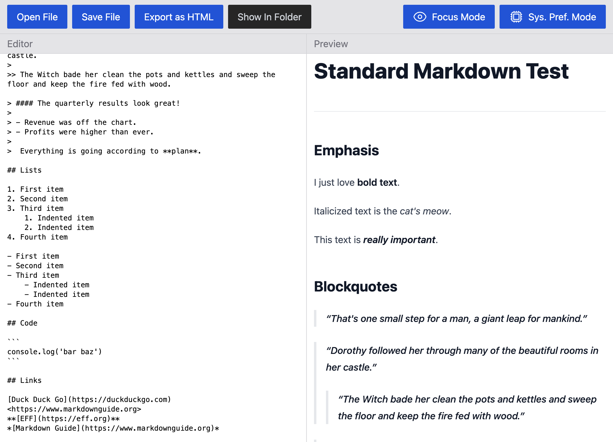

# Markdown Editor

This is a [markdown](https://daringfireball.net/projects/markdown) editor desktop app written in [TypeScript](https://typescriptlang.org) with [Electron](https://electronjs.org) and [React](https://react.dev).

The app has the following features:

- Support for [GitHub flavored markdown](https://github.github.com/gfm)
- Real-time preview of markdown
- [Light mode](./src/playwright/color-mode.test.ts-snapshots/light-mode-chromium-darwin.png) & [dark mode](./src/playwright/color-mode.test.ts-snapshots/dark-mode-chromium-darwin.png)
- Focus mode that reduces UI elements to the essentials for those that prefer a minimalist user experience
- Export markdown preview as HTML

## Technology Overview

This project extends the [**React + Electron (TypeScript)** starter](https://github.com/mattlean/lean-js-app-starter/tree/v1.1.0-dev/starters/react-electron-ts) with the following:

- [unified](https://unifiedjs.com), [rehype](https://unifiedjs.com/explore/package/rehype), [remark](https://unifiedjs.com/explore/package/remark): Libraries for working with markdown & HTML
- [Tailwind CSS](https://tailwindcss.com): Utility-first CSS framework

The remaining technologies are inherited from the starter:

- [TypeScript](https://typescriptlang.org): JavaScript with type safety
- [Electron](https://electronjs.org): Framework for building desktop apps through [Node.js](https://nodejs.org) & [Chromium](https://chromium.org)
- [React](https://react.dev): Library for user interfaces
- [CSS](https://w3.org/Style/CSS/Overview.en.html): The standard language for styling
- [Embedded JavaScript (EJS)](https://ejs.co): Templating language used to generate the build's `index.html` document
- [Jest](https://jestjs.io): Testing framework
- [React Testing Library](https://testing-library.com/docs/react-testing-library/intro): Unit testing library specialized for React components
- [Mock Service Worker (MSW)](https://mswjs.io): API mocking library used to mock network requests
- [Playwright](https://playwright.dev): End-to-end (E2E) testing
- [webpack](https://webpack.js.org): Bundler used to create builds
- [Babel](https://babeljs.io): Compiler used with webpack to support TypeScript and output Electron-compatible code
- [ESLint](https://eslint.org): Linter used to identify problems in TypeScript & JavaScript
- [Stylelint](https://stylelint.io): Linter used to identify problems in CSS
- [Prettier](https://prettier.io): Formatter used to enforce code style
- [Husky](https://typicode.github.io/husky) + [lint-staged](https://github.com/okonet/lint-staged): Pre-commit hooks to check for type, lint, and formatting errors before Git commits are made
- [npm](https://npmjs.com): Package manager

## Run This on Your Machine

Please refer to the ["Getting Started" section in the **React + Electron (TypeScript)** starter's `README.md`](https://github.com/mattlean/lean-js-app-starter/tree/v1.1.0-dev/starters/react-electron-ts#getting-started).

## LJAS Documentation

[📖 Learn more about **Lean JS App Starter** by reading its docs.](https://github.com/mattlean/lean-js-app-starter/tree/v1.1.0-dev/docs/README.md)
